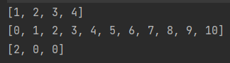

# IntArray
IntArray의 간단한 사용법

```kotlin

   //선언과 동시에 초기화
    var intArr1 : IntArray = intArrayOf(1,2,3,4)
    //IntArray를 임의로 선언
    var intArr2 : IntArray = intArrayOf()
    //사이즈를 3으로 만들고 모든 값을 0으로 초기화
    var intArr3  = IntArray(3) { 0 }
    
    intArr3[0] = 2
	
    //위의 intArr2에 값 넣어주기
    //코틀린에는 IntArray 클래스의 plus + 연산자를 재정의한 함수가 있어 += 연산자를 사용하여 값을 추가 할 수 있습니다.
    (0..10).map { intArr2 += it }
    
    //출력
    println(intArr1.contentToString())
    println(intArr2.contentToString())
    println(intArr3.contentToString())
    
```
### 실행결과
<br>